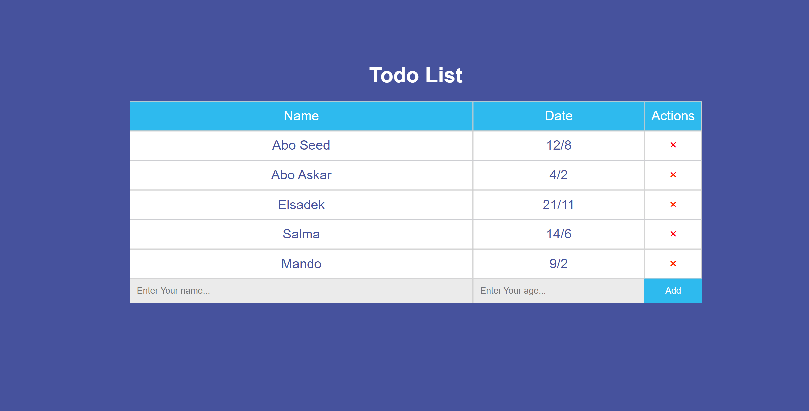

# Todo List 

This very todo list application written with react.js to save all notes for name and date and you have two option, first to add items have name and dete, second you can delet any items from list.

## Live Demo
-Link: https://ahmed-abo-rafat.github.io/Todo_List/

## To begin:
``npx create-react-app my-app``  
``cd my-app``  
`replace the public and src folders with those in this repo.`  
``npm start``

## Technologies
Project is created with:
  - React.Js
  - html
  - css

## Features
  - Component to show: it takes all elements from state and show this elment with map function.
  - Component to add items: make function take a new element and out in show in list.
  - Delet items: it is x icon to delet item from list.

### Result

